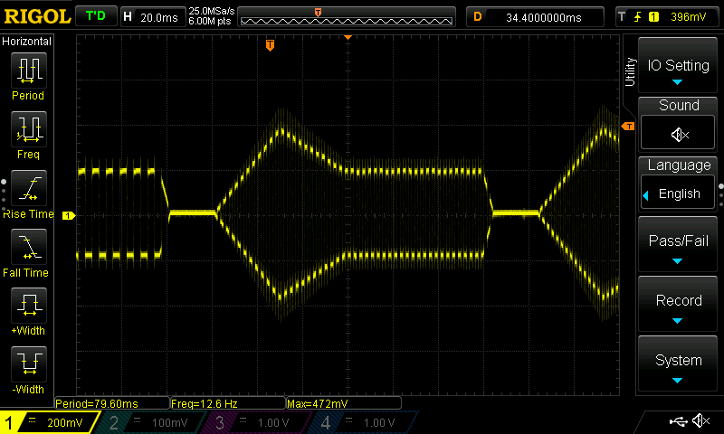

# Undosa: Waveform Generation for I2S

[Undosa](https://www.coachellavalleysurfclub.org/post/undosa-the-wave-kingdom) is a Rust library that provides waveform synthesis for no_std environments meant for eventual ouput over I2S.

## Example: Playing an A440 Sawtooth note with ADSR Filter

```rust
let generator = SawtoothWaveGenerator::new(44800, 440)
    .quantize(tempo, note_duration, detachment)
    .envelope(attack, decay, sustain, release);

let sample_0: i16 = generator.next().unwrap();
```

## Working Sample Note

Setup:

- STM32F4 Discovery Board
- PCM5102 I2S Board
- 48K Sample Rate, 16 bit audio


